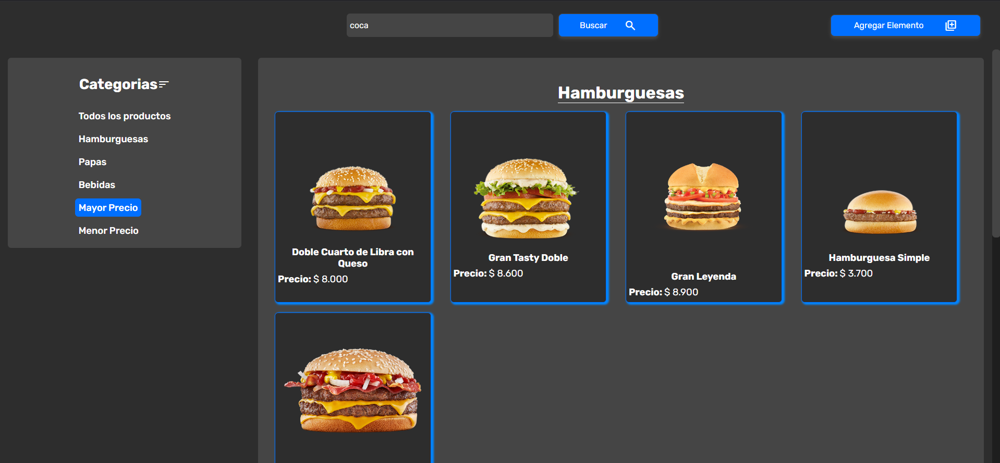

# PROYECTO INTEGRADOR HTML-CSS-JAVASCRIPT

Este proyecto es una aplicación web para una empresa que se dedica a la venta de indumentaria. La aplicación permitirá visualizar los productos disponibles, filtrar por categorias, ordenar por precio y añadir nuevos productos.

## Deployment

Link del Vercel:

https://integrador-front-jet.vercel.app/

## Video de prueba

https://youtu.be/NUoNsVmzwnY

## Tecnologías Utilizadas

- HTML
- CSS
- JavaScript
- NodeJs
- Vite

## Estructura del Proyecto

```
IntegradorFrontEnd/
├── node_modules/
├── public/
│   ├── src/
│   │   ├── persistence/
│   │   ├── services/
│   │   │   ├── categories.js
│   │   │   ├── products.js
│   │   │   ├── searchBar.js
│   │   ├── views/
│   │   │   ├── modal.js
│   │   │   ├── store.js
│   ├── gitignore
│   ├── image.png
│   └── index.html
├── main.js
├── package-lock.json
├── package.json
└── README.md
└── style.css
```

## Capturas de Pantalla




## Ejemplo

Se puede utilizar los siguientes ejemplos para probar la introduccion de elementos a la página

Copiar y pegar el los campos correspondientes o directamente en el value del LocalStorage

```json
[
  {
    "id": "2024-10-18T13:02:18.775Z",
    "nombre": "Doble Cuarto de Libra con Queso",
    "imagen": "https://cache-backend-mcd.mcdonaldscupones.com/media/image/product$kqXt7Sq2/200/200/original?country=ar",
    "precio": "8.000",
    "categoria": "Hamburguesas"
  },
  {
    "id": "2024-10-18T13:11:31.064Z",
    "nombre": "Gran Tasty Doble",
    "imagen": "https://cache-backend-mcd.mcdonaldscupones.com/media/image/product$kqX3hBwW/200/200/original?country=ar",
    "precio": "8.600",
    "categoria": "Hamburguesas"
  },
  {
    "id": "2024-10-18T13:12:38.215Z",
    "nombre": "Gran Leyenda",
    "imagen": "https://cache-backend-mcd.mcdonaldscupones.com/media/image/product$kgXDtPDq/200/200/original?country=ar",
    "precio": "8.500",
    "categoria": "Seleccione una categoria"
  },
  {
    "id": "2024-10-18T13:12:55.228Z",
    "nombre": "Gran Leyenda",
    "imagen": "https://cache-backend-mcd.mcdonaldscupones.com/media/image/product$kgXDtPDq/200/200/original?country=ar",
    "precio": "8.900",
    "categoria": "Hamburguesas"
  },
  {
    "id": "2024-10-18T13:13:46.715Z",
    "nombre": "Gaseosa Chica",
    "imagen": "https://cache-backend-mcd.mcdonaldscupones.com/media/image/product$kcXf3XY0/200/200/original?country=ar",
    "precio": "2.200",
    "categoria": "Bebidas"
  },
  {
    "id": "2024-10-18T13:14:04.796Z",
    "nombre": "Gaseosa Mediana",
    "imagen": "https://cache-backend-mcd.mcdonaldscupones.com/media/image/product$kcXf3XY0/200/200/original?country=ar",
    "precio": "2.500",
    "categoria": "Bebidas"
  },
  {
    "id": "2024-10-18T13:14:30.123Z",
    "nombre": "Gaseosa Grande",
    "imagen": "https://cache-backend-mcd.mcdonaldscupones.com/media/image/product$kcXf3XY0/200/200/original?country=ar",
    "precio": "2.800",
    "categoria": "Bebidas"
  },
  {
    "id": "2024-10-18T13:15:00.333Z",
    "nombre": "Agua sin gas",
    "imagen": "https://cache-backend-mcd.mcdonaldscupones.com/media/image/product$kcX11dSt/200/200/original?country=ar",
    "precio": "2.000",
    "categoria": "Bebidas"
  },
  {
    "id": "2024-10-18T13:15:34.682Z",
    "nombre": "Papas Fritas Pequeñas",
    "imagen": "https://cache-backend-mcd.mcdonaldscupones.com/media/image/product$kAXDtZBB/200/200/original?country=ar",
    "precio": "2.700",
    "categoria": "Papas"
  },
  {
    "id": "2024-10-18T13:15:56.159Z",
    "nombre": "Papas Fritas Medianas",
    "imagen": "https://cache-backend-mcd.mcdonaldscupones.com/media/image/product$kEXemacS/200/200/original?country=ar",
    "precio": "2.900",
    "categoria": "Papas"
  },
  {
    "id": "2024-10-18T13:16:20.256Z",
    "nombre": "Papas Fritas Grandes",
    "imagen": "https://cache-backend-mcd.mcdonaldscupones.com/media/image/product$kcXXQgnB/200/200/original?country=ar",
    "precio": "3.100",
    "categoria": "Papas"
  },
  {
    "id": "2024-10-18T13:17:23.969Z",
    "nombre": "Hamburguesa Simple",
    "imagen": "https://cache-backend-mcd.mcdonaldscupones.com/media/image/product$kqXzqebG/200/200/original?country=ar",
    "precio": "3.700",
    "categoria": "Hamburguesas"
  },
  {
    "id": "2024-10-18T13:18:12.837Z",
    "nombre": "Gran Doble McBacon",
    "imagen": "https://cache-backend-mcd.mcdonaldscupones.com/media/image/product$kQXnpmyG/200/200/original?country=ar",
    "precio": "8.600",
    "categoria": "Hamburguesas"
  }
]
```

## Color Reference

```css
 {
  --azulClarito: #0085ff;
  --azulPastel: #69b4ff;
  --azulOscuro: #006fff;
  --negro: #1e1e1e;
  --negroClaro: #2d2d2d;
  --gris: #454545;
  --blanco: #ffffff;
  --naranja: #ff6600;
  --naranjaClarito: #ff983f;
  --rojo: #c21d03;
  --rojoClarito: #fd5732;
}
```

## Autor

- **Nombre**: Fabio Escudero
- **Comisión**: 3K10
- **Materia**: Desarrollo de Software
- Universidad Técnologica Nacional, Mendoza

- [Link GitHub](https://github.com/XxFabio24xX)
